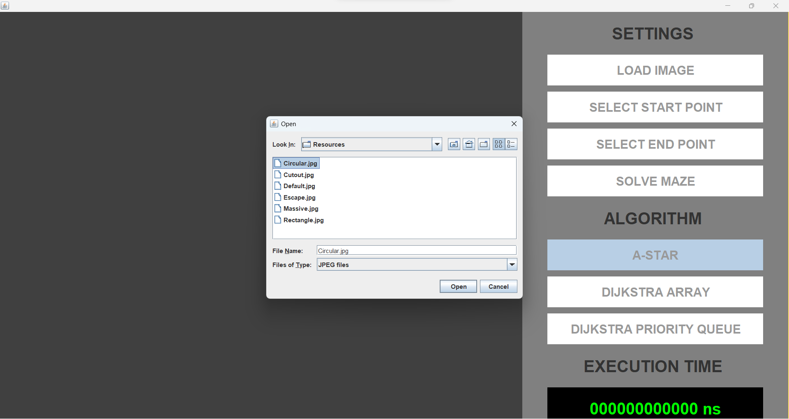
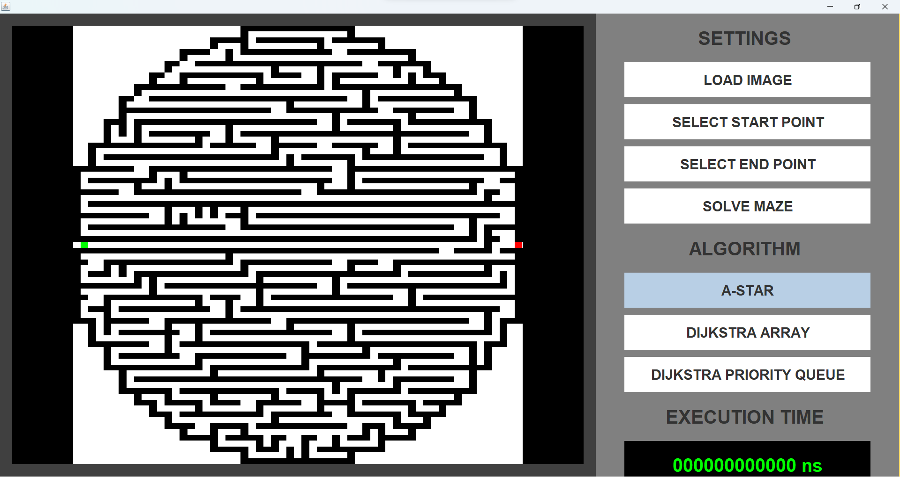
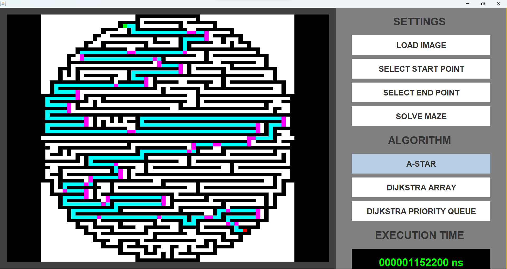
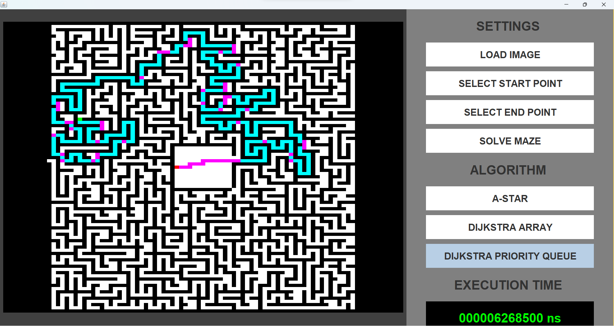
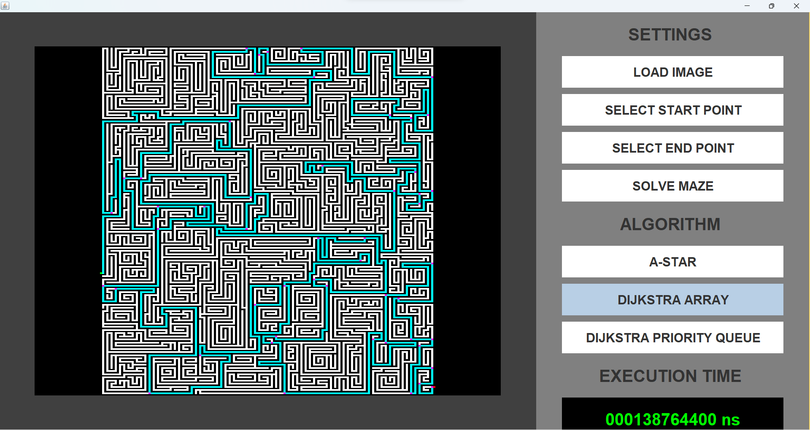
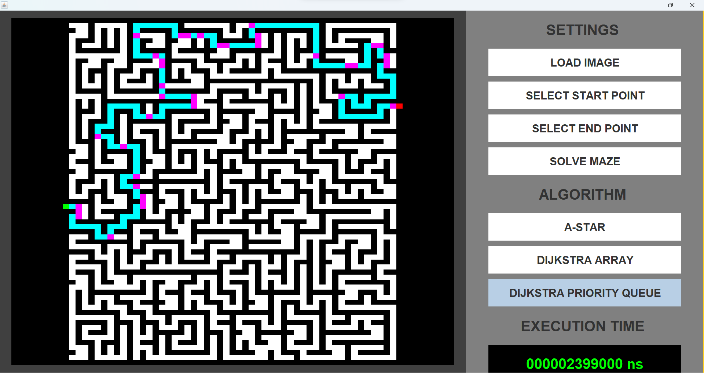

# Overview
This was a school project in collaboration with one other student. This is a program that solves mazes with A* or one of two versions of Dijkstra with different data structures. The solver takes in a maze as a .jpg file and then solves it with the chosen starting point, end point and algorithm. The program is written in Java and has a GUI created with Swing. Some example mazes are also provided in the source code.

# Screenshots
Screenshots of the maze solver in use. The green points represent the starting points, the red points represent the end points, the purple points represent every step of the path where the algorithm made a choice and the blue represent the rest of the path. Some mazes are already included in the resources folder.

